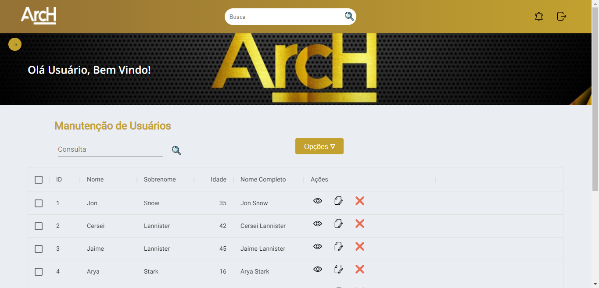

<h1 align="center">Projeto ArcHOffice</h1>

<h2>Projeto de uma Dashboard simples</h2>

O porjeto consiste de uma interface simples contendo alguns ítens requisitados no mapa mental, boa parte do site não responde a comandos, pois o propósito é meramente ilustrativo.

<i>Screenshot da tela com a barra lateral ativada.</i>

A única funcionalidade é a possibilidade de recuar a Sidebar através de um botão no canto esquerdo, achei que seria bom para caso um possível usuário necessitasse de uma vista menos poluída.

<i>Screenshot da tela com a barra lateral recuada.</i>

E obviamente não pode faltar a responsividade.

<i>Execuçao do App em tamanho mobile.</i>

<h2>Tecnologias Utilizadas</h2>

<ul>
  <li>React</li>
  <li>Material UI</li>
</ul>

<h2>Link para vizualização</h2>

O app está disponível para visualização <a href="https://arch.vercel.app/">aqui</a>.

<h2>Acessando os arquivos do App</h2>

Inicialmente deve-se clonar o repositório, após concluído, deve ter o Node instalado em sua máquina para que possa puxar os pacotes do NPM.

Com o Node instalado, abra um terminal na raiz da pasta do App e execute o comando:

<code>npm install</code>

Aguarde o npm puxar todos os pacotes utilizados no projeto, assim que concluir, execute o comando a seguir para rodar a aplicação.

<code>npm start</code>
